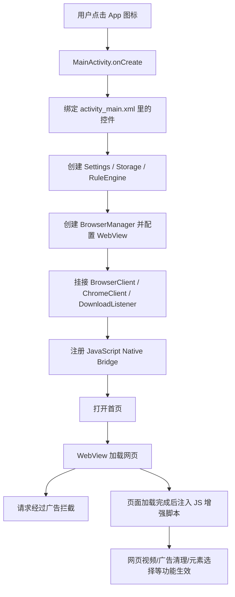
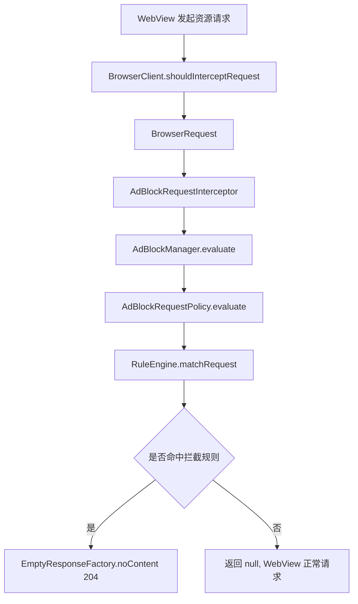
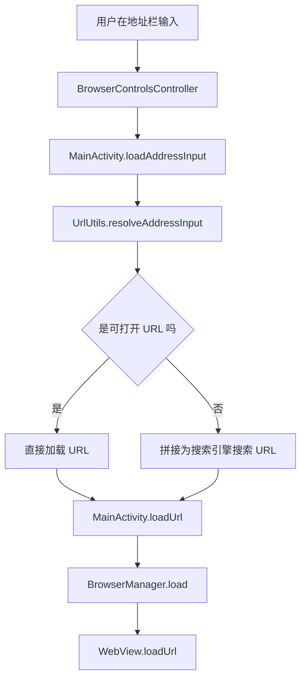
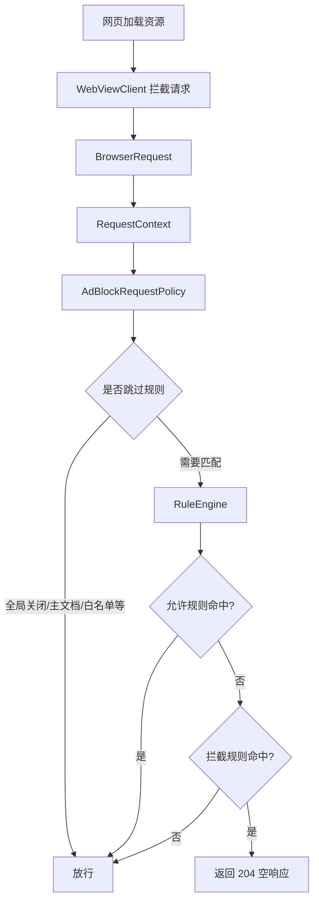
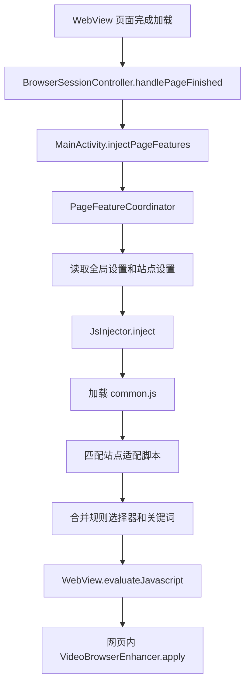
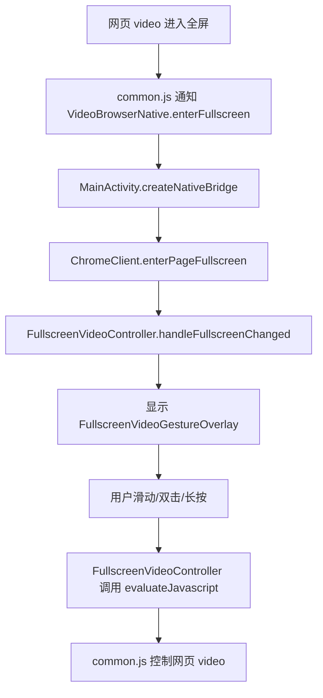
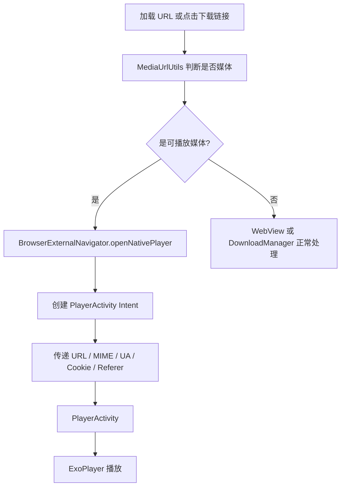
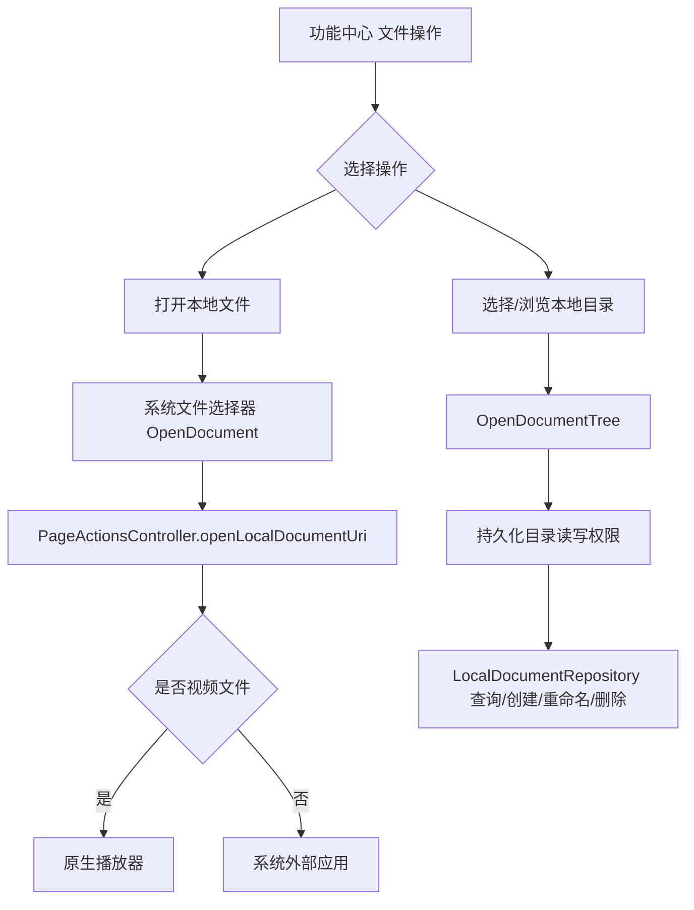

# VideoBrowser 项目代码解析

本文档根据当前代码编写，目标读者是没有开发基础、但希望能看懂项目结构和运行逻辑的人。读完后，你应该能知道这个项目是什么、使用了什么框架、每个目录大概负责什么、用户打开一个网页时代码是怎样一步步工作的。

> 说明：当前终端中部分中文注释和 `strings.xml` 文本显示为乱码，但类名、方法名、资源引用和业务流程可以正常识别。本文档按代码实际职责进行解释，不逐字引用乱码文本。

## 1. 项目一句话介绍

VideoBrowser 是一个 Android 视频浏览器 App。

它的核心能力包括：

- 用 WebView 打开网页。
- 支持多个搜索入口，例如搜狗、360、夸克、UC、百度、Bing。
- 拦截常见广告请求。
- 注入本地 JavaScript，隐藏页面广告、弹窗、登录提示等干扰元素。
- 增强网页视频体验，例如网页全屏、手势快进快退、倍速、音量和亮度控制。
- 对直接的视频链接使用原生播放器 Media3/ExoPlayer 播放。
- 支持本地文件和授权目录的浏览、打开、分享、重命名、删除。
- 提供浏览器工具页，用于设置、书签、历史、拦截日志、白名单、站点配置等操作。

这个项目没有后端服务，也没有数据库服务器。它是一个单体 Android 应用，大部分数据保存在手机本地的 SharedPreferences 中。

## 2. 给零基础读者的几个关键词

### Android App

Android App 是安装在安卓手机或模拟器上的应用。这个项目最终会被 Gradle 打包成 APK。

### Kotlin

Kotlin 是 Android 常用开发语言。项目主要代码都写在 `.kt` 文件中。

### Gradle

Gradle 是构建工具，负责下载依赖、编译代码、运行测试、打包 App。项目中的 `build.gradle.kts`、`settings.gradle.kts`、`gradle/` 都和 Gradle 有关。

### Module

Module 可以理解为项目里的一个构建单元。当前项目只有一个业务模块：`:app`。

### Activity

Activity 是 Android 的一个页面。这个项目里有两个主要页面：

- `MainActivity`：浏览器主页面。
- `PlayerActivity`：原生视频播放器页面。

### WebView

WebView 是 Android 提供的网页容器。它可以在 App 里显示网页，类似把浏览器内核嵌进应用。

### assets

`assets` 是 App 内置文件目录。项目把广告规则和 JavaScript 脚本放在这里，运行时读取。

### res

`res` 是 Android 资源目录。布局 XML、颜色、主题、图标、文案都放在这里。

### SharedPreferences

SharedPreferences 是 Android 自带的小型本地键值存储。项目用它保存设置、书签、历史、白名单、本地目录授权等数据。

## 3. 技术栈总览

项目使用的主要技术如下：

| 类别 | 当前代码中的选择 | 作用 |
| --- | --- | --- |
| 开发语言 | Kotlin / Java 11 编译目标 | 编写 Android 业务代码 |
| 构建工具 | Gradle Kotlin DSL | 编译、测试、打包 |
| Android Gradle Plugin | `9.2.1` | Android 项目构建插件 |
| 最低系统版本 | `minSdk = 24` | App 支持 Android 7.0 及以上 |
| 目标系统版本 | `targetSdk = 36` | 面向较新的 Android API |
| 页面基础库 | AppCompat | 兼容传统 Android 页面能力 |
| UI 辅助库 | Material、ConstraintLayout | 主题、控件、布局 |
| 播放器 | AndroidX Media3 ExoPlayer | 原生播放视频、HLS、DASH、RTSP 等 |
| 单元测试 | JUnit 4 | 测试工具类、规则引擎、设置等纯逻辑 |
| 仪器测试 | AndroidX Test、Espresso | 在 Android 环境中测试 WebView/广告拦截等 |

## 4. 根目录结构

项目根目录是：

```text
VideoBrowser/
```

当前根目录主要文件和目录如下：

| 路径 | 类型 | 作用 |
| --- | --- | --- |
| `.git/` | Git 目录 | 版本控制数据，平时不需要手动修改 |
| `.gradle/` | Gradle 缓存 | Gradle 本地生成目录，通常不提交、不手改 |
| `.idea/` | Android Studio/IntelliJ 配置 | IDE 配置，部分文件可能因本机环境变化 |
| `.kotlin/` | Kotlin 缓存 | Kotlin/Gradle 生成目录 |
| `app/` | App 模块 | 项目最重要的业务代码都在这里 |
| `gradle/` | Gradle 版本和依赖配置 | 包含版本目录和 Gradle Wrapper 配置 |
| `.gitignore` | Git 忽略规则 | 指定哪些生成文件不纳入版本控制 |
| `build.gradle.kts` | 根构建文件 | 声明根项目插件 |
| `settings.gradle.kts` | Gradle 设置 | 声明项目名、仓库、包含 `:app` 模块 |
| `gradle.properties` | Gradle 属性 | JVM、AndroidX、构建相关属性 |
| `gradlew` | Linux/macOS 构建脚本 | 不安装全局 Gradle 也能构建项目 |
| `gradlew.bat` | Windows 构建脚本 | Windows 下使用的 Gradle Wrapper |
| `local.properties` | 本机 SDK 配置 | 通常记录 Android SDK 路径，不应提交敏感配置 |
| `开发目标.md` | 项目文档 | 现有开发目标说明 |
| `开发设计文档.md` | 项目文档 | 现有设计说明 |
| `开发流程与进度.md` | 项目文档 | 现有开发进度记录 |
| `项目代码解析.md` | 本文档 | 根据代码整理的项目结构解析 |

## 5. Gradle 构建配置

### `settings.gradle.kts`

这个文件做三件事：

- 配置插件仓库：`google()`、`mavenCentral()`、`gradlePluginPortal()`。
- 设置根项目名：`VideoBrowser`。
- 引入模块：`include(":app")`。

这说明当前项目只有一个 App 模块。

### 根目录 `build.gradle.kts`

根构建文件只声明 Android 应用插件：

```kotlin
plugins {
    alias(libs.plugins.android.application) apply false
}
```

这里的 `apply false` 表示根项目先声明插件版本，真正使用插件的是 `app/build.gradle.kts`。

### `gradle/libs.versions.toml`

这是 Gradle Version Catalog，也就是依赖版本集中管理文件。

里面定义了：

- Android Gradle Plugin 版本。
- AndroidX Core、AppCompat、Activity、ConstraintLayout。
- Media3 ExoPlayer 相关依赖。
- JUnit、Espresso 等测试依赖。

这样做的好处是版本统一，不用在多个 Gradle 文件里到处写版本号。

### `app/build.gradle.kts`

这是 App 模块的核心构建配置。

关键内容：

- `namespace = "com.example.videobrowser"`：代码命名空间。
- `applicationId = "com.example.videobrowser"`：安装到手机上的 App 包名。
- `compileSdk = 36.1`：用哪个 Android SDK 编译。
- `minSdk = 24`：最低支持 Android 7.0。
- `targetSdk = 36`：面向 Android 36 行为。
- `versionCode = 1` / `versionName = "1.0"`：App 版本信息。
- `release.isMinifyEnabled = false`：发布包当前没有开启混淆压缩。
- `sourceCompatibility = JavaVersion.VERSION_11`：Java 编译目标是 11。

主要依赖：

- `androidx.appcompat`：Activity 和兼容 UI。
- `androidx.constraintlayout`：主布局使用 ConstraintLayout。
- `androidx.media3`：原生播放器 ExoPlayer。
- `material`：Material 风格主题/控件。
- `junit`、`espresso`：测试。

## 6. App 模块结构

`app/` 是项目最重要的目录。

```text
app/
  build.gradle.kts
  proguard-rules.pro
  src/
    main/
      AndroidManifest.xml
      java/com/example/videobrowser/
      assets/
      res/
    test/
    androidTest/
```

| 路径 | 作用 |
| --- | --- |
| `app/build.gradle.kts` | App 模块构建配置 |
| `app/proguard-rules.pro` | 混淆规则文件，当前 release 未启用混淆 |
| `app/src/main/AndroidManifest.xml` | Android 入口声明、权限、Activity 注册 |
| `app/src/main/java/com/example/videobrowser/` | Kotlin 主业务代码 |
| `app/src/main/assets/rules/` | 内置广告/页面规则 |
| `app/src/main/assets/scripts/` | 内置网页增强 JavaScript |
| `app/src/main/res/layout/` | XML 页面布局 |
| `app/src/main/res/drawable/` | 图标、背景 shape、矢量资源 |
| `app/src/main/res/mipmap-*/` | App 启动图标 |
| `app/src/main/res/values/` | 文案、颜色、主题 |
| `app/src/main/res/xml/` | 备份规则、网络安全配置等 |
| `app/src/test/` | 本地 JVM 单元测试 |
| `app/src/androidTest/` | Android 设备/模拟器测试 |

## 7. Manifest 入口

文件位置：

```text
app/src/main/AndroidManifest.xml
```

Manifest 声明了：

- 权限：`android.permission.INTERNET`，允许访问网络。
- Application 图标、名称、主题、网络安全配置。
- 两个 Activity：
  - `.MainActivity`：启动页，`exported="true"`，带 `MAIN` 和 `LAUNCHER`，用户点 App 图标进入它。
  - `.video.PlayerActivity`：播放器页，`exported="false"`，只能被 App 内部打开。

两个 Activity 都设置了：

```xml
android:hardwareAccelerated="true"
android:configChanges="keyboardHidden|orientation|screenSize"
```

这对 WebView 和视频播放很重要：硬件加速有助于网页/视频渲染，`configChanges` 表示横竖屏等变化时由 Activity 自己处理，避免频繁销毁重建。

## 8. 主代码包总览

主代码根包是：

```text
app/src/main/java/com/example/videobrowser/
```

当前主要包和职责如下：

| 包/目录 | Kotlin 文件数 | 职责 |
| --- | ---: | --- |
| `videobrowser` 根包 | 2 | `MainActivity` 和主页面 View 绑定 |
| `browser/` | 13 | WebView 管理、浏览器控件、页面状态、请求模型 |
| `browser/search/` | 2 | 搜索引擎配置和首页搜索入口 |
| `adblock/` | 8 | 广告请求拦截、决策、日志、空响应 |
| `rules/` | 11 | 规则解析、编译、索引、匹配 |
| `inject/` | 3 | JavaScript 脚本加载、拼装、注入协调 |
| `site/` | 4 | 站点适配器和域名匹配 |
| `functioncenter/` | 10 | 浏览器工具页、设置页、日志页、书签历史页等 |
| `settings/` | 1 | 设置读写和站点级配置 |
| `storage/` | 2 | SharedPreferences 抽象、书签历史仓库 |
| `video/` | 4 | 原生播放器、网页全屏视频手势控制 |
| `localfiles/` | 7 | 本地文件选择、目录授权、文件操作 |
| `download/` | 1 | 系统下载器接入 |
| `element/` | 1 | 页面元素选择和自定义隐藏规则 |
| `utils/` | 2 | URL 解析和媒体 URL 判断 |

## 9. 整体运行流程

下面是 App 从启动到显示网页的大致流程：



项目设计上把 `MainActivity` 当成总装配入口。它自己不承担所有细节，而是创建很多控制器，把这些控制器接在一起。

## 10. 根包：主页面入口

### `MainActivity.kt`

这是项目最核心的入口类。

它负责：

- 打开 `activity_main.xml` 布局。
- 绑定页面控件。
- 初始化设置、规则、存储、WebView、下载、播放器、工具页等模块。
- 注册 WebView 的客户端回调。
- 注册 JavaScript 和 Android 之间通信的桥。
- 处理返回键。
- 处理首页加载、地址栏输入、外部打开、原生播放器打开。

`MainActivity` 里的成员变量很多，但大部分是“控制器”：

- `BrowserManager`：管理 WebView。
- `BrowserControlsController`：管理顶部地址栏、底部按钮。
- `BrowserSessionController`：管理当前页面 URL、标题、加载进度。
- `FunctionCenterController` / `FunctionCenterPages`：管理工具页。
- `SettingsManager`：管理设置。
- `RuleEngine`：管理广告和元素规则。
- `AdBlockManager` / `AdBlockRequestInterceptor`：广告请求拦截。
- `JsInjector` / `PageFeatureCoordinator`：脚本注入。
- `FullscreenVideoController`：网页全屏视频手势层。
- `DownloadController`：下载。
- `LocalFilesController`：本地文件。
- `ElementPickerController`：用户点击页面元素后生成屏蔽规则。

### `MainActivityViews.kt`

这是一个 View 绑定辅助类。

它把 `activity_main.xml` 里的控件一次性找出来，包装成 `MainActivityViews`：

- `webView`
- `addressInput`
- `topBar`
- `bottomBar`
- `pageProgress`
- `searchProviderScroll`
- `privateBrowsingBadge`
- 各种按钮
- `fullscreenContainer`

这样 `MainActivity` 不需要到处写 `findViewById`。

## 11. `browser/`：WebView 浏览器核心

`browser/` 包负责浏览器基础能力。

### `BrowserManager.kt`

这是 WebView 的统一包装类。

它做的事情包括：

- 配置 Cookie。
- 开启 JavaScript。
- 开启 DOM Storage。
- 允许媒体自动播放。
- 设置缓存模式。
- 禁用文件访问：`allowFileAccess = false`。
- 设置 WebViewClient 和 WebChromeClient。
- 加载 URL、后退、前进、刷新。
- 开启或关闭无痕模式。
- 清理缓存、历史、表单、Cookie、WebStorage。
- 销毁 WebView。
- 在页面切换前执行 `VideoBrowserEnhancer.suspend()`，让注入脚本暂停页面视频等状态。

简单理解：凡是直接操作 WebView 的动作，都尽量通过 `BrowserManager` 完成。

### `BrowserClient.kt`

这是对 Android `WebViewClient` 的封装。

它负责把 WebView 回调转成项目内部事件：

- 页面开始加载：调用 `pageStarted(url)`。
- 页面完成加载：调用 `pageFinished(url)`。
- 请求拦截：把 WebView 请求转换成 `BrowserRequest`，再交给广告拦截。
- URL 跳转判断：把跳转交给 `MainActivity.shouldBlockUrl()` 判断。

### `ChromeClient.kt`

这是对 `WebChromeClient` 的封装。

它负责：

- 页面加载进度。
- 页面标题。
- 网页视频全屏。
- Android 系统 UI 隐藏。
- 横竖屏切换。
- 把网页全屏自定义 View 放到 `fullscreenContainer` 里。

当网页里的视频进入全屏时，通常会走到这里。

### `BrowserSessionController.kt`

这个类管理“当前页面状态”：

- 当前 URL：`currentPageUrl`
- 当前标题：`currentPageTitle`
- 是否正在加载：`isPageLoading`
- 页面开始/完成时如何更新地址栏、进度条、导航按钮。
- 页面加载完成后触发历史记录保存和脚本注入。

它让页面生命周期状态集中在一个地方。

### `BrowserControlsController.kt`

这个类管理浏览器顶部和底部控件：

- 地址栏输入。
- 打开按钮。
- 返回按钮。
- 刷新按钮。
- 首页按钮。
- 收藏按钮。
- 页面工具按钮。
- 进度条显示。
- 收藏图标状态。

它把“点按钮后做什么”连接到 `MainActivity` 提供的回调。

### `BrowserControlsScrollController.kt`

这个类管理滚动时隐藏/显示顶部和底部栏。

逻辑大概是：

- 用户向下滚动网页一段距离后隐藏浏览器控件。
- 用户向上滚动网页一段距离后显示浏览器控件。
- 首页、地址栏聚焦、视频全屏时不按普通滚动逻辑处理。
- 如果用户手指还没抬起，会延迟应用隐藏/显示状态，避免 UI 抖动。

### `BrowserExternalNavigator.kt`

这个类负责打开外部目标：

- 用系统浏览器/其他 App 打开 URL。
- 用项目内部的 `PlayerActivity` 打开媒体 URL。
- 给播放器传递标题、MIME 类型、User-Agent、Cookie、Referer。

这对一些需要鉴权 Cookie 或 Referer 的视频链接很重要。

### `PageActionsController.kt`

这是“当前页面操作”的集合：

- 添加/取消收藏。
- 复制链接。
- 分享页面。
- 外部打开。
- 原生播放器打开。
- 下载当前 URL。
- 清理浏览数据。
- 开启/关闭无痕模式。
- 恢复默认设置。
- 打开本地文件 URI。
- 添加历史记录。

工具页里的很多按钮最终会调用它。

### `BrowserRequest.kt`

这是项目内部统一的 WebView 请求模型。

它包含：

- 请求 URL。
- 是否主文档请求。
- HTTP 方法。
- 请求头。
- 是否用户手势触发。
- 是否重定向。
- 当前页面 URL。

广告拦截和规则匹配会使用它。

### `RequestContext.kt`

这是规则匹配时使用的上下文。

它会从请求里整理出：

- 请求 URL。
- 当前页面 URL。
- 请求 host。
- 当前页面 host。
- 请求 scheme。
- 是否主文档。
- 请求头。
- 推断出的资源类型。

比 `BrowserRequest` 更适合规则系统使用。

### `ResourceType.kt` 和 `ResourceTypeResolver.kt`

`ResourceType` 是资源类型枚举：

- 文档
- 脚本
- 图片
- CSS
- 媒体
- 字体
- XHR/Fetch
- 其他
- 未知

`ResourceTypeResolver` 会根据请求头和 URL 后缀推断资源类型。例如 `.js` 推断为脚本，`.mp4` 推断为媒体。

### `VideoBrowserNativeBridge.kt`

这是 JavaScript 调用 Android 的桥。

网页中注入的 `common.js` 可以通过 `window.VideoBrowserNative` 调用 Android 方法：

- 进入/退出全屏。
- 上报视频播放进度。
- 请求屏蔽用户选中的页面元素。
- 取消元素选择器。

所有桥方法都通过 `postToUi` 切回 Android 主线程执行。

## 12. `browser/search/`：搜索引擎入口

### `SearchProvider.kt`

定义搜索引擎数据结构：

- `id`
- 名称
- 徽标
- 首页 URL
- 搜索 URL 前缀
- 主题色

默认搜索入口包含：

- 搜狗
- 360 搜索
- 夸克搜索
- UC
- 百度
- Bing

### `SearchProviderController.kt`

负责首页搜索入口 UI 和搜索引擎选择。

它做的事情包括：

- 根据保存的设置选择默认搜索引擎。
- 在首页横向显示多个搜索入口。
- 点击某个搜索入口后保存选择，并把首页切到对应搜索引擎。
- 地址栏显示时把搜索结果 URL 还原为搜索词。
- 判断当前 URL 是否是搜索引擎首页。

## 13. `adblock/`：广告请求拦截

广告请求拦截的目标是：当 WebView 请求一个广告资源时，直接返回一个空响应，让网页拿不到广告内容。

### 核心流程



### `AdBlockManager.kt`

广告拦截入口。

它把运行时状态和规则系统连接起来：

- 全局广告拦截是否开启。
- 当前站点是否关闭广告拦截。
- 请求 host 是否在用户白名单。
- 当前页面 URL 和 host。
- 规则引擎。
- 日志记录器。

### `AdBlockRequestPolicy.kt`

广告拦截决策策略。

它按顺序判断：

1. 全局广告拦截是否关闭。
2. 是否主文档请求。主文档请求不拦截，避免整页打不开。
3. 是否非 HTTP/HTTPS 协议。
4. 请求 host 是否在用户白名单。
5. 当前站点是否关闭广告拦截。
6. 是否命中允许规则。
7. 是否命中拦截规则。
8. 都没有命中则放行。

### `AdBlockRequestInterceptor.kt`

把广告判断结果转换成 WebView 能理解的响应。

- 应拦截：返回 204 空响应。
- 不拦截：返回 `null`，让 WebView 继续正常请求。

### `EmptyResponseFactory.kt`

统一创建空响应：

- MIME：`text/plain`
- 编码：`utf-8`
- 状态码：204 No Content
- body：空字节数组

### `BuiltInAdBlockRules.kt`

内置广告请求规则。

包含常见广告域名和 URL 关键词，例如：

- `doubleclick.net`
- `googlesyndication.com`
- `googleadservices.com`
- `ads.youtube.com`
- `/pagead/`
- `/adserver/`
- `/vast`
- `/preroll`

这些会和 assets 中的规则一起进入规则引擎。

### `AdBlockDecision.kt`

广告拦截决策结果：

- 是否拦截。
- 决策原因。
- 命中的规则。

### `AdBlockLogger.kt` 和 `AdBlockLogEntry.kt`

保存最近的拦截/放行记录。

日志存在内存里，默认最多 80 条。工具页可以查看和清空这些记录。

## 14. `rules/`：规则系统

规则系统负责把文本规则变成可以快速匹配的规则对象。

### 规则来源

规则来源包括：

- `BuiltInAdBlockRules` 中写死的内置请求规则。
- `app/src/main/assets/rules/request_rules.txt`
- `app/src/main/assets/rules/css_rules.txt`
- `app/src/main/assets/rules/dom_rules.txt`
- App 私有缓存目录下的同名规则文件，预留给后续更新。

### `Rule.kt`

请求级规则模型。

一条请求规则包含：

- `id`：规则 ID。
- `pattern`：匹配内容。
- `type`：规则类型。
- `action`：允许或拦截。
- `source`：来源。
- `domainScope`：适用页面域名范围。
- `thirdParty`：是否第三方请求限制。
- `resourceTypes`：资源类型限制。

支持的请求规则类型：

- `URL_CONTAINS`：URL 包含某段文字。
- `URL_PATTERN`：带通配符/锚点的 URL 模式。
- `DOMAIN_CONTAINS`：请求域名匹配某个域。

支持的动作：

- `ALLOW`：允许。
- `BLOCK`：拦截。

注意：规则匹配时允许规则优先于拦截规则。

### `RuleFileLoader.kt`

负责读取 assets 和缓存中的规则文件。

它支持三类规则：

1. 请求规则：广告请求拦截。
2. CSS 规则：生成页面隐藏选择器。
3. DOM 规则：生成页面移除选择器。

它也会跳过不支持或不安全的规则，并记录原因。

### `RuleCompiler.kt`

把解析后的规则编译成项目内部能力：

- 请求规则能力。
- CSS 隐藏能力。
- CSS 反隐藏能力。
- DOM 移除能力。

同时会建立索引，帮助匹配更快。

### `RuleMatcher.kt`

真正判断一条请求是否命中某条规则。

它会同时考虑：

- URL。
- 请求 host。
- 当前页面 host。
- 资源类型。
- 是否第三方请求。
- 域名范围。

### `RuleEngine.kt`

规则系统对外的主入口。

它提供：

- `matchRequest()`：判断请求是否允许或拦截。
- `cssSelectorsFor()`：给某个页面生成 CSS 隐藏选择器。
- `domSelectorsFor()`：给某个页面生成 DOM 移除选择器。
- `urlContainsBlockPatternsFor()`：给 JS 侧提供一些 URL 关键词。

### `RequestRuleIndex.kt`

请求规则索引。

它把规则按以下方式组织：

- 域名规则按 host 后缀索引。
- URL contains 规则按稳定关键词索引。
- 无法索引的规则放入 fallback。

目的：减少每次请求都遍历全部规则的成本。

### `ElementRuleIndex.kt`

页面元素规则索引。

带域名限制的规则按页面 host 后缀索引，通用规则进入 fallback。

### `DomainScope.kt`

管理规则适用的域名范围。

例如：

- 只对某个域名生效。
- 排除某个域名。
- 没有限制则全部页面生效。

### `ElementRule.kt`

页面元素规则模型。

类型包括：

- `CSS_HIDE`：通过 CSS 隐藏元素。
- `CSS_UNHIDE`：取消某些隐藏规则。
- `DOM_REMOVE`：从 DOM 中移除元素。

## 15. `inject/`：JavaScript 注入系统

这个项目不只是拦截网络请求，还会向网页注入本地 JavaScript，用来清理页面元素、增强视频控制、和 Android 通信。

### `ScriptLoader.kt`

负责从 assets 读取脚本文件。

它有安全限制：

- 脚本路径必须在 `scripts/` 目录下。
- 必须以 `.js` 结尾。
- 不能包含反斜杠、`..`、空路径段。

这避免随意读取 assets 外的文件。

### `JsInjector.kt`

负责拼装并执行注入脚本。

它会：

- 读取 `scripts/common.js`。
- 根据当前页面 URL 找到匹配的站点适配脚本。
- 合并配置：
  - 是否允许 JS 注入。
  - 是否开启页面清理。
  - 是否开启视频增强。
  - CSS 隐藏选择器。
  - 用户自定义选择器。
  - DOM 移除选择器。
  - URL 拦截关键词。
- 通过 `evaluateJavascript()` 注入到 WebView。

为了避免重复安装，它使用 JS 全局标记：

- `__VIDEOBROWSER_COMMON_SCRIPT_INSTALLED__`
- `__VIDEOBROWSER_SITE_SCRIPT_FLAGS__`

### `PageFeatureCoordinator.kt`

这是页面增强功能的协调器。

它根据全局设置和站点级设置决定：

- 当前站点是否允许广告拦截。
- 当前站点是否允许 JS 注入。
- 当前站点是否允许页面清理。
- 当前站点是否允许视频增强。

页面加载完成后，`MainActivity` 会调用它注入页面增强功能。

## 16. `assets/scripts/`：网页增强脚本

路径：

```text
app/src/main/assets/scripts/
```

当前脚本包括：

| 文件 | 作用 |
| --- | --- |
| `common.js` | 通用页面清理、视频增强、元素选择、Android 桥接 |
| `youtube.js` | YouTube 专用广告/跳过/视频控制处理 |
| `bilibili.js` | Bilibili 专用页面清理和视频控制 |
| `iqiyi.js` | 爱奇艺专用页面清理和视频控制 |
| `tencent.js` | 腾讯视频专用页面清理和视频控制 |
| `youku.js` | 优酷专用页面清理和视频控制 |

### `common.js` 的主要能力

`common.js` 很大，是网页增强的核心。

它大致做这些事：

- 定义通用广告选择器。
- 注入 CSS，把广告、弹窗、登录提示等元素隐藏。
- 按规则移除 DOM 元素。
- 劫持部分 `window.open` 和 `fetch` 请求，对明显广告 URL 做阻断。
- 自动点击跳过广告按钮。
- 增强网页 `<video>` 标签：
  - 开启原生 controls。
  - 双击进入/退出全屏。
  - 上报播放进度给 Android。
  - 响应 Android 发来的 seek、倍速、播放暂停等命令。
- 支持元素选择器：
  - 用户点击页面元素。
  - 生成 CSS 选择器。
  - 通过 `VideoBrowserNative` 交给 Android 保存。
- 支持页面暂停/销毁：
  - `suspend()`
  - `dispose()`

### 站点脚本的作用

站点脚本比 `common.js` 小很多，主要做站点特化：

- 隐藏特定 class/id 的广告区域。
- 点击特定文案的关闭、取消、跳过按钮。
- 给视频标签开启 controls。
- 定时重复执行，因为视频网站页面经常动态刷新 DOM。

## 17. `site/`：站点适配器

站点适配器负责判断当前网页属于哪个视频网站，然后加载对应脚本。

### `SiteProfile.kt`

站点静态描述：

- `id`
- 展示名
- 域名集合
- 脚本路径
- CSS 选择器
- DOM 选择器

### `SiteAdapter.kt`

站点适配器接口。

它要求实现：

- `profile`
- `matches(url)`

默认脚本列表、选择器列表来自 `SiteProfile`。

### `SiteAdapterRegistry.kt`

站点适配器注册表。

当前默认站点：

| id | 域名 | 脚本 |
| --- | --- | --- |
| `youtube` | `youtube.com` | `scripts/youtube.js` |
| `bilibili` | `bilibili.com` | `scripts/bilibili.js` |
| `iqiyi` | `iqiyi.com` | `scripts/iqiyi.js` |
| `tencent` | `v.qq.com` | `scripts/tencent.js` |
| `youku` | `youku.com` | `scripts/youku.js` |

如果当前页面 host 是这些域名或其子域名，就会匹配对应适配器。

### `SiteHost.kt`

统一处理 host 解析和标准化。

例如把：

```text
HTTPS://WWW.EXAMPLE.COM.
```

标准化为：

```text
www.example.com
```

这对设置、白名单、规则匹配都很重要。

## 18. `functioncenter/`：浏览器工具页

功能中心可以理解为 App 内置的“工具抽屉”。它不是单独 XML 页面，而是 Kotlin 动态创建 View，然后覆盖到主页面上。

### `FunctionCenterController.kt`

负责显示和关闭工具页。

它会把工具页 View 添加到 `MainActivity` 的根布局上，并处理返回逻辑。

### `FunctionCenterViewFactory.kt`

负责创建工具页 UI 控件：

- 页面标题栏。
- 返回按钮。
- 分组标题。
- 信息行。
- 操作行。
- 开关行。
- 空状态。
- 操作按钮。
- 分隔线。

功能中心的多个页面复用这套 UI 构建方法。

### `FunctionCenterPageHost.kt`

这是对 `FunctionCenterController` 的轻量包装。

子页面只依赖 `FunctionCenterPageHost`，不用直接依赖完整控制器。

### `FunctionCenterPages.kt`

功能中心页面总路由。

根页面包含两大块：

- 当前网页操作：
  - 收藏/取消收藏。
  - 复制链接。
  - 分享页面。
  - 桌面模式。
  - 外部打开。
  - 原生播放器打开。
  - 下载当前地址。
  - 选择页面元素进行屏蔽。
- 更多：
  - 当前站点设置。
  - 浏览器设置。

它还创建并连接多个子页面。

### `CurrentSiteSettingsPage.kt`

当前站点设置页。

可以针对当前 host 单独配置：

- 广告拦截开关。
- JS 注入开关。
- 页面清理开关。
- 视频增强开关。
- 添加站点元素屏蔽规则。
- 加入/移出白名单。
- 查看当前站点配置。

站点级设置会覆盖全局设置中的部分行为。

### `BrowserSettingsPage.kt`

浏览器全局设置页。

包括：

- 无痕浏览。
- 广告请求拦截。
- 网页脚本增强。
- 页面清理。
- 视频增强。
- 打开书签。
- 打开历史。
- 文件操作。
- 拦截日志。
- 用户白名单管理。
- 清理浏览数据。
- 恢复默认设置。

### `SavedPagesPage.kt`

书签和历史记录页面共用这个类。

它可以：

- 展示保存的页面列表。
- 点击某条记录重新打开。
- 清空当前列表。

### `AdBlockLogPage.kt`

拦截日志页。

它可以：

- 展示最近的拦截/放行记录。
- 清空日志。
- 对被拦截的 host 发起加入用户白名单操作。

### `UserWhitelistPage.kt`

用户白名单管理页。

它可以：

- 添加当前站点到白名单。
- 查看已有白名单 host。
- 移除某个白名单 host。

白名单的含义是：对该请求 host 放行广告请求规则。

### `RestoreDefaultSettingsPage.kt`

恢复默认设置确认页。

它调用 `SettingsManager.restoreDefaults()` 删除设置项，然后重新创建 Activity。

## 19. `settings/`：设置管理

### `SettingsManager.kt`

这是项目设置中心。

它读写的内容包括：

- 全局广告拦截开关。
- 站点级广告拦截关闭列表。
- 全局 JS 注入开关。
- 站点级 JS 注入关闭列表。
- 全局页面清理开关。
- 站点级页面清理关闭列表。
- 全局视频增强开关。
- 站点级视频增强关闭列表。
- 用户白名单 host。
- 用户自定义元素隐藏规则。
- 默认视频倍速。
- 首页 URL。
- 搜索引擎 ID。
- 桌面模式。
- 无痕浏览。

它还负责对输入值做标准化，例如：

- host 标准化。
- 首页 URL 必须是 HTTP/HTTPS。
- 视频倍速必须大于 0。
- 用户 CSS selector 不能太长，不能包含危险字符。

### 用户元素隐藏规则

当用户用元素选择器屏蔽某个页面元素时，项目会保存：

```text
host + selector
```

存储格式是每行一条，用制表符分隔：

```text
example.com    .some-ad-card
```

后续打开同一站点时，这些 selector 会通过 JS 注入继续隐藏对应元素。

## 20. `storage/`：本地存储

### `PreferenceStore.kt`

这是对 SharedPreferences 的接口封装。

它提供：

- `getBoolean` / `putBoolean`
- `getFloat` / `putFloat`
- `getString` / `putString`
- `remove`
- `contains`

真正实现类是内部的 `SharedPreferencesStore`。

SharedPreferences 文件名：

```text
browser_preferences
```

### `SavedPageRepository.kt`

书签和历史记录仓库。

数据模型：

```kotlin
data class SavedPage(
    val title: String,
    val url: String
)
```

它把书签和历史序列化成 JSON 数组，保存在 SharedPreferences 中。

限制：

- 收藏最多 100 条。
- 历史最多 80 条。

重复 URL 会被去重，并把最新记录放到最前面。

## 21. `video/`：播放器和全屏视频手势

这个包负责两类视频体验：

1. 网页中的视频全屏增强。
2. 独立原生播放器 `PlayerActivity`。

### `PlayerActivity.kt`

这是原生播放器页面。

它使用 Media3 ExoPlayer 播放：

- 普通视频直链。
- HLS：`.m3u8`
- DASH：`.mpd`
- SmoothStreaming。
- RTSP。
- 带 Cookie、Referer、User-Agent 的远程媒体。

主要能力：

- 自动横屏进入播放器。
- 保存播放位置、播放状态、倍速、方向。
- 控制系统状态栏/导航栏隐藏。
- 播放失败时 Toast 提示。
- 使用 `FullscreenVideoGestureOverlay` 作为手势层。

### `FullscreenVideoController.kt`

这是网页全屏视频控制器。

它连接：

- WebView 里的 JS 视频增强逻辑。
- Android 原生手势覆盖层。
- `ChromeClient` 的网页全屏状态。

它能让用户在网页视频全屏时使用类似原生播放器的手势。

### `FullscreenVideoGestureOverlay.kt`

这是手势覆盖层，既用于网页全屏，也用于原生播放器。

支持：

- 中间单击：播放/暂停。
- 左侧双击：快退 10 秒。
- 右侧双击：快进 10 秒。
- 横向滑动：拖动进度。
- 左侧上下滑动：调亮度。
- 右侧上下滑动：调音量。
- 左/右长按：倒退扫描或 2 倍速播放。
- 锁定按钮：锁住手势。
- 倍速按钮：选择 0.75x、1x、1.25x、1.5x、2x、3x。
- 旋转按钮：切换横竖屏。

### `VideoGestureFeedbackFormatter.kt`

负责把手势反馈格式化成人类可读文本，例如：

- `1.5x`
- `+10s`
- `-10s`
- `01:20 / 05:30`

## 22. `download/`：下载控制

### `DownloadController.kt`

这个类接入 WebView 的下载监听器。

逻辑：

- 如果下载 URL 是可播放媒体，优先用原生播放器打开。
- 否则调用 Android 系统 `DownloadManager` 下载。
- 下载时带上 User-Agent 和 Cookie。
- 下载失败时尝试交给外部应用打开。

下载文件会保存到系统公共下载目录：

```text
Environment.DIRECTORY_DOWNLOADS
```

## 23. `localfiles/`：本地文件和目录操作

这个包基于 Android Storage Access Framework，也就是系统文件选择器和授权目录能力。

### `LocalFilesController.kt`

本地文件功能主控制器。

它提供：

- 打开单个本地文件。
- 授权一个本地目录。
- 浏览已授权目录。
- 新建文件夹。
- 新建文本文件。
- 刷新目录。
- 打开文件。
- 分享文件。
- 重命名文件。
- 删除文件。

如果打开的是视频文件，会进入原生播放器；否则交给系统外部应用。

### `LocalFileLaunchers.kt`

注册 Android Activity Result：

- `OpenDocument()`：选择一个文件。
- `OpenDocumentTree()`：选择一个目录。

选择目录后会尝试持久化读写权限。

### `LocalDirectoryPermissionManager.kt`

管理目录授权：

- 保存授权目录 URI。
- 清除授权目录 URI。
- 获取持久读写权限。
- 释放旧目录权限。

授权目录 URI 也保存在 SharedPreferences 中。

### `LocalDocumentRepository.kt`

真正和 Android `DocumentsContract` 交互：

- 查询目录内容。
- 创建文档。
- 重命名文档。
- 删除文档。
- 构建文档 URI。

### `LocalDocument.kt`

本地文档模型。

字段包括：

- URI。
- documentId。
- 名称。
- MIME 类型。
- 大小。
- 修改时间。
- flags。

它还提供：

- `isDirectory`
- `canDelete`
- `canRename`

### `LocalDocumentFormatter.kt`

把文件信息格式化成摘要：

- 文件夹显示为文件夹类型。
- 文件显示 MIME 类型、大小、修改时间。

### `LocalDirectoryPathItem.kt`

表示当前目录路径中的一个节点：

- documentId
- 标题

用于在目录内前进/后退。

## 24. `element/`：页面元素选择器

### `ElementPickerController.kt`

这是用户自定义屏蔽元素功能。

流程：

1. 用户在工具页点击“屏蔽元素”。
2. Android 检查当前站点是否可用、JS 注入是否开启。
3. Android 注入页面增强脚本。
4. Android 调用 `VideoBrowserEnhancer.startElementPicker()`。
5. 用户点击网页上的元素。
6. JS 生成 CSS selector 和描述。
7. JS 调用 `VideoBrowserNative.requestElementBlock()`。
8. Android 弹出确认框。
9. 用户确认后保存到 `SettingsManager`。
10. 再次注入脚本，让该元素立即隐藏。

为了避免长时间挂起，元素选择会有 60 秒超时。

## 25. `utils/`：工具类

### `UrlUtils.kt`

负责 URL 和搜索输入处理。

它能处理：

- 地址栏输入为空时不加载。
- 输入完整 URL 时直接打开。
- 输入域名时自动补 `https://` 或 `http://`。
- 输入普通关键词时拼成搜索 URL。
- 支持 localhost、IPv4、IPv6。
- 解码搜索结果 URL 中的搜索词。
- 把 URL 显示成更友好的文本。
- 避免明显不安全的空白字符和控制字符。

### `MediaUrlUtils.kt`

判断一个 URI 是否可被原生播放器播放。

判断依据包括：

- URL 后缀，例如 `.mp4`、`.m3u8`、`.mpd`。
- MIME 类型，例如 `video/*`、`application/dash+xml`。
- 协议，例如 `rtsp`、`rtspt`。
- 支持 `http`、`https`、`content`、`file`。

## 26. `res/`：Android 资源

资源目录负责 UI 的静态资源。

### `res/layout/`

| 文件 | 作用 |
| --- | --- |
| `activity_main.xml` | 浏览器主页面布局 |
| `activity_player.xml` | 原生播放器页面布局 |

### `activity_main.xml`

主页面结构：

- 根布局：`ConstraintLayout`
- 顶部栏：地址栏、无痕标识、收藏按钮、工具按钮。
- 进度条：网页加载进度。
- 搜索引擎横向列表。
- WebView 容器。
- 底部栏：返回、刷新、首页。
- 全屏容器：网页视频全屏时使用。

### `activity_player.xml`

播放器页面结构很简单：

- 根布局：黑色 `FrameLayout`
- `androidx.media3.ui.PlayerView`

手势覆盖层不是 XML 写死的，而是 Kotlin 中动态 addView。

### `res/drawable/`

包含：

- 地址栏背景。
- 按钮背景。
- 匿名/无痕标识背景。
- 搜索、返回、前进、刷新、首页、收藏、更多等矢量图标。
- 启动图标前景/背景。

### `res/mipmap-*/`

不同屏幕密度的 App 图标：

- `app_logo`
- `app_logo_round`
- 默认 `ic_launcher`

### `res/values/`

| 文件 | 作用 |
| --- | --- |
| `strings.xml` | App 文案 |
| `colors.xml` | 颜色定义 |
| `themes.xml` | App 主题 |

当前主题是：

```xml
Theme.Material3.DayNight.NoActionBar
```

也就是没有系统 ActionBar，页面顶部栏由项目自己实现。

### `res/xml/`

| 文件 | 作用 |
| --- | --- |
| `network_security_config.xml` | 网络安全配置 |
| `backup_rules.xml` | 备份规则 |
| `data_extraction_rules.xml` | Android 数据提取规则 |

## 27. `assets/rules/`：规则文件

路径：

```text
app/src/main/assets/rules/
```

| 文件 | 作用 |
| --- | --- |
| `request_rules.txt` | 请求拦截规则 |
| `css_rules.txt` | CSS 隐藏规则 |
| `dom_rules.txt` | DOM 移除规则 |

### 请求规则

请求规则用于广告请求拦截。

支持类似广告拦截规则的子集，例如：

```text
||example-ad.com^
/ads/
@@||safe.example.com^
```

支持部分选项：

- `third-party`
- `~third-party`
- `domain=...`
- `script`
- `image`
- `stylesheet`
- `media`
- `font`
- `xmlhttprequest`
- `fetch`

不支持的语法会被跳过并记录。

### CSS 规则

CSS 规则用于生成隐藏元素选择器。

示例：

```text
example.com##.ad-card
example.com#@#.do-not-hide
```

含义：

- `##`：隐藏。
- `#@#`：例外，不隐藏。

### DOM 规则

DOM 规则用于移除元素。

当前支持前缀：

```text
remove:.selector
```

### 选择器安全限制

为了避免注入危险内容，选择器会被校验：

- 不能为空。
- 长度不能超过 200。
- 不能包含 `{}`、`;`、`<`、`>`。
- 不支持 `:has()`、`:contains()`、`:matches()`、`:xpath()` 等复杂或危险语法。
- 不允许 `javascript:`、`expression()`。

## 28. 关键业务流程详解

### 28.1 用户输入地址或搜索词



示例：

- 输入 `https://example.com`：直接打开。
- 输入 `example.com`：补成 `https://example.com`。
- 输入 `localhost:8080`：倾向补成 `http://localhost:8080`。
- 输入 `猫咪视频`：变成当前搜索引擎的搜索 URL。

### 28.2 网页请求被广告拦截



这个流程只影响子资源请求，不会拦截主网页本身。

### 28.3 页面加载完成后注入增强脚本



注入后，网页里会出现：

- `window.VideoBrowserEnhancer`
- `window.__VIDEOBROWSER_CONFIG__`
- `window.VideoBrowserSiteAdapters`
- `window.VideoBrowserNative`

### 28.4 网页视频全屏手势



这就是网页视频也能拥有接近原生播放器手势体验的原因。

### 28.5 直接视频链接进入原生播放器



### 28.6 本地文件操作



## 29. 数据保存位置和格式

项目主要数据存在 SharedPreferences：

```text
browser_preferences
```

大致保存内容：

| 数据 | 保存方式 | 说明 |
| --- | --- | --- |
| 全局开关 | Boolean | 广告拦截、JS 注入、页面清理、视频增强、桌面模式、无痕浏览 |
| 搜索引擎 | String | 搜索引擎 id |
| 首页 URL | String | 当前首页地址 |
| 默认视频倍速 | Float | 原生播放器和网页全屏视频使用 |
| 书签 | JSON 字符串 | `SavedPage` 数组，最多 100 条 |
| 历史 | JSON 字符串 | `SavedPage` 数组，最多 80 条 |
| 站点级关闭列表 | 多行 String | 每行一个 host |
| 用户白名单 | 多行 String | 每行一个 host |
| 用户元素隐藏规则 | 多行 String | 每行 `host + tab + selector` |
| 本地目录授权 URI | String | 用于下次继续访问已授权目录 |

无痕模式开启后：

- 不记录历史。
- 切换或退出时清理 Cookie、缓存、站点数据。
- WebView 缓存模式切到 `LOAD_NO_CACHE`。

## 30. 测试目录

### 本地单元测试：`app/src/test/`

这些测试运行在 JVM 上，不需要真机。

覆盖范围包括：

- URL 解析：`UrlUtilsTest`
- 脚本加载和注入：`ScriptLoaderTest`、`JsInjectorTest`
- 站点匹配：`SiteHostTest`、`SiteAdapterRegistryTest`
- 请求上下文和资源类型：`RequestContextTest`、`ResourceTypeResolverTest`
- 设置管理：`SettingsManagerTest`
- 规则系统：`RuleCompilerTest`、`RuleEngineTest`、`RuleFileLoaderTest`、`RuleIndexLargeFilePerformanceTest`
- 广告拦截：`AdBlockRequestPolicyTest`、`BuiltInAdBlockRulesTest`、`AdBlockLoggerTest`

### Android 仪器测试：`app/src/androidTest/`

这些测试需要模拟器或真机。

覆盖范围包括：

- 基础仪器测试。
- 广告请求拦截 Android 环境测试。
- JS 注入 Android 环境测试。

## 31. 新开发者如何运行项目

### 用 Android Studio

1. 用 Android Studio 打开项目根目录 `VideoBrowser`。
2. 等待 Gradle Sync 完成。
3. 选择一个 Android 模拟器或连接真机。
4. 点击 Run 运行 `app`。

### 用命令行运行测试

Windows 下可以使用：

```powershell
.\gradlew.bat test
```

运行 Android 仪器测试需要设备或模拟器：

```powershell
.\gradlew.bat connectedAndroidTest
```

### 常见前置条件

- 本机需要安装 Android Studio 或 Android SDK。
- `local.properties` 通常需要包含 `sdk.dir=...`。
- 第一次构建可能需要联网下载 Gradle 依赖。

## 32. 如果要新增功能，应该改哪里

### 新增一个视频网站适配

通常需要：

1. 在 `app/src/main/assets/scripts/` 新增一个站点脚本，例如 `newsite.js`。
2. 在 `SiteAdapterRegistry.default()` 中新增一个 `domainAdapter`。
3. 写单元测试验证 URL 能匹配到该适配器。

涉及文件：

- `site/SiteAdapterRegistry.kt`
- `assets/scripts/*.js`
- `site/SiteAdapterRegistryTest.kt`

### 新增广告请求规则

如果是内置规则：

- 修改 `BuiltInAdBlockRules.kt`。

如果是文本规则：

- 修改 `assets/rules/request_rules.txt`。

建议同时补充：

- `RuleEngineTest`
- `AdBlockRequestPolicyTest`

### 新增页面元素隐藏规则

通用 CSS 隐藏：

- 修改 `assets/rules/css_rules.txt`。

DOM 移除：

- 修改 `assets/rules/dom_rules.txt`。

用户临时自定义：

- 通过 App 的“屏蔽元素”功能保存到设置中。

### 新增一个工具页

通常需要：

1. 在 `functioncenter/` 新增一个页面类。
2. 在 `FunctionCenterPages.kt` 中创建并接入。
3. 如果需要文案，修改 `res/values/strings.xml`。
4. 如有设置项，修改 `SettingsManager.kt`。

### 新增一个设置项

通常需要：

1. 在 `SettingsManager.kt` 添加 key、默认值、getter、setter。
2. 在 `BrowserSettingsPage.kt` 或 `CurrentSiteSettingsPage.kt` 添加 UI。
3. 在相关业务模块读取这个设置。
4. 添加 `SettingsManagerTest`。

### 修改地址栏 URL 识别逻辑

重点看：

- `utils/UrlUtils.kt`
- `utils/UrlUtilsTest.kt`
- `browser/search/SearchProviderController.kt`

### 修改播放器手势

重点看：

- `video/FullscreenVideoGestureOverlay.kt`
- `video/FullscreenVideoController.kt`
- `video/PlayerActivity.kt`
- `video/VideoGestureFeedbackFormatter.kt`

## 33. 当前项目的架构特点

### 1. 单模块 Android App

项目只有 `:app` 一个模块。结构简单，适合当前规模。

### 2. MainActivity 负责装配，业务拆到控制器

`MainActivity` 很大，但它主要做“创建和连接对象”。实际功能被拆分到多个 controller、manager、repository 中。

### 3. XML + Kotlin 动态 UI 混合

主页面和播放器页面使用 XML。

功能中心页面使用 Kotlin 动态创建 View。

这样做的结果是：

- 主框架稳定。
- 工具页可以通过代码快速拼装。

### 4. WebView + 本地 JS 增强

项目不是普通浏览器壳，而是会向网页注入本地 JS。核心增强逻辑在 `common.js` 中。

### 5. 请求拦截和页面清理双路线

广告处理有两层：

- 网络层：WebView 请求拦截。
- 页面层：JS 隐藏或删除 DOM 元素。

这能覆盖更多场景。

### 6. 规则系统有安全边界

规则解析时会拒绝不支持或危险的语法，尤其是 CSS selector 和脚本路径。

### 7. 原生播放器和网页播放器共享手势体验

`FullscreenVideoGestureOverlay` 同时服务于：

- `PlayerActivity`
- 网页全屏视频

这减少了重复实现。

## 34. 注意事项和潜在维护点

### 中文资源编码

当前终端读取到的部分中文资源和注释是乱码。如果 Android Studio 中也显示乱码，应统一检查文件编码，建议使用 UTF-8。

### WebView 安全

项目已经禁用了 `allowFileAccess`，脚本也只从本地 assets 读取。后续如果增加远程脚本或更开放的文件访问，需要特别谨慎。

### 规则规模

项目已经有 `RequestRuleIndex` 和 `ElementRuleIndex`，说明作者考虑了大规则文件性能。后续引入更多规则时，应继续关注匹配性能和内存占用。

### 无痕模式

无痕模式会清理浏览数据并不记录历史，但收藏和设置仍然保留。修改相关逻辑时要避免误删用户数据。

### 本地文件权限

目录访问依赖 Android 的持久 URI 权限。如果用户撤销权限或目录不可用，代码会清理保存的 URI 并提示重新选择。

### 视频直链判断

`MediaUrlUtils` 主要基于后缀、MIME、协议判断是否可播放。某些视频网站的动态播放地址可能没有明显后缀，需要结合 MIME 或后续扩展识别逻辑。

## 35. 推荐阅读顺序

如果你是第一次看这个项目，建议按下面顺序读代码：

1. `app/build.gradle.kts`：知道依赖和 Android 配置。
2. `AndroidManifest.xml`：知道 App 入口。
3. `activity_main.xml`：知道主页面长什么样。
4. `MainActivity.kt`：知道所有模块如何装配。
5. `browser/BrowserManager.kt`：知道 WebView 怎么配置。
6. `browser/BrowserClient.kt`：知道网页请求和加载回调从哪里来。
7. `adblock/AdBlockRequestPolicy.kt`：知道广告拦截决策。
8. `rules/RuleEngine.kt`：知道规则如何被使用。
9. `inject/JsInjector.kt` 和 `assets/scripts/common.js`：知道页面增强如何生效。
10. `functioncenter/FunctionCenterPages.kt`：知道工具页有哪些入口。
11. `video/PlayerActivity.kt` 和 `FullscreenVideoGestureOverlay.kt`：知道播放器能力。
12. `settings/SettingsManager.kt` 和 `storage/SavedPageRepository.kt`：知道数据怎么保存。

## 36. 总结

VideoBrowser 的本质是一个“带视频增强和广告清理能力的 Android WebView 浏览器”。

它的核心链路是：

```text
MainActivity
  -> BrowserManager 管 WebView
  -> BrowserClient 接收网页请求和加载事件
  -> AdBlockManager + RuleEngine 判断请求是否拦截
  -> JsInjector 注入 common.js 和站点脚本
  -> FunctionCenterPages 提供用户操作入口
  -> PlayerActivity + FullscreenVideoGestureOverlay 提供视频体验
  -> SettingsManager + PreferenceStore 保存用户数据
```

对零基础开发者来说，最重要的是先建立这个整体图景：  
`MainActivity` 是总入口，`browser/` 管网页，`adblock/` 和 `rules/` 管广告拦截，`inject/` 和 `assets/scripts/` 管网页增强，`functioncenter/` 管工具页，`video/` 管播放体验，`storage/` 和 `settings/` 管本地数据。

只要按这个结构去读代码，就不会被文件数量吓到。
